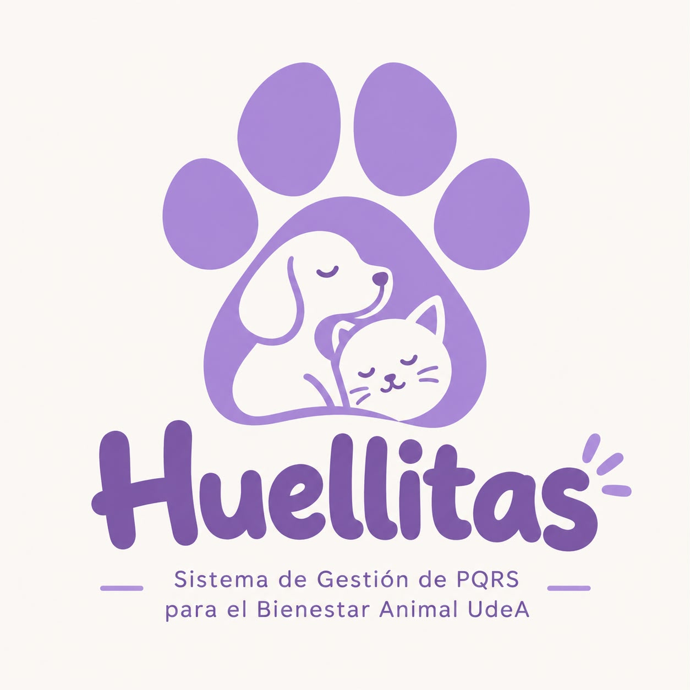

# Huellitas🐾🐶🐱
### Sistema de gestión de PQRS para el bienestar animal UdeA

## 1. - 2. Integrantes👯👯
### •	Laura Valentina Forero Rojas
Soy estudiante de Ingeniería Industrial con interés por la organización de procesos, el análisis de información y el desarrollo de soluciones que mejoren la gestión administrativa. Me destaco por ser responsable, creativa y metódica al documentar proyectos, elaborar informes y estructurar el trabajo en equipo. Dentro del desarrollo de Huellitas puedo aportar en la planificación del proyecto y la documentación en GitHub.

### •	Isabela Naranjo Gómez
Soy estudiante de Ingeniería Industrial y me interesa aprender sobre diferentes áreas de la carrera y adquirir nuevos conocimientos. Me considero una persona responsable, perfeccionista y analítica, por lo que me gusta trabajar con detalle, revisar la información y comprender bien cada actividad antes de realizarla. También tengo una actitud de aprendizaje constante y un alto compromiso con los proyectos en los que participo. Dentro del desarrollo de Huellitas, puedo aportar principalmente en el manejo y organización de los datos, la gestión de los archivos del programa y la revisión detallada de la información.

### •	Luciana Mejía Cardona
Soy estudiante de Ingeniería Industrial y me interesan especialmente temas como la automatización, el manejo del personal, el control de calidad y la producción. Me considero una persona paciente, curiosa, sociable y alegre. También me gusta hacer las cosas de la mejor manera posible, por lo que suelo ser muy detallista y cuidadosa al momento de revisar mi trabajo. Dentro de un equipo me gusta proponer ideas y buscar nuevas perspectivas, pero también escuchar las opiniones de los demás y apoyar la opción que mejor contribuya al objetivo del proyecto. Para la realización de nuestro proyecto "Hellitas", puedo aportar principalmente en el diseño, el manejo de datos y la programación, además de la revisión de errores, la organización de estructuras y la elaboración de presentaciones.

### •	Juliana Silva Moreno
Soy estudiante de Ingeniería Industrial, con interés por aprender y desarrollar conocimientos en diferentes áreas de la carrera. Me caracterizo por ser una persona creativa, comprometida y con iniciativa, a quien le gusta proponer ideas, buscar soluciones y cuidar los detalles en los proyectos que realiza. También considero importante el trabajo en equipo y la comunicación para lograr buenos resultados. Dentro del desarrollo de Huellitas, puedo aportar principalmente en la generación de ideas, la organización y planificación del proyecto, el análisis de información y la elaboración de propuestas que contribuyan al desarrollo del programa.

## 3. Huellitas🐾🐾

Huellitas es un sistema de gestión de PQRS diseñado para registrar y administrar las solicitudes relacionadas con el bienestar de perros y gatos de la Universidad de Antioquia. El software permitirá almacenar la información de cada caso en archivos planos independientes, generar radicados consecutivos, consultar el estado de las solicitudes y obtener estadísticas que apoyen la gestión del programa de bienestar animal. Su desarrollo se realizará completamente en Python mediante una aplicación de consola intuitiva y fácil de utilizar.

## 4. Licencia del software🧑‍💻🪪
>* <a href="https://github.com/isabelanaranjo-code/Trabajo-final">Huellitas</a> © 2026 by <a href="https://github.com/isabelanaranjo-code/Trabajo-final">Laura Valentina Forero Rojas, Isabela Naranjo Gómez, Luciana Mejía Cardona, Juliana Silva Moreno</a> is licensed under <a href="https://creativecommons.org/licenses/by-nc-nd/4.0/">CC BY-NC-ND 4.0</a>

## 5. Reporte de visión🗒️🖋️
### Visión

Desarrollar un software confiable y organizado que facilite la gestión de las PQRS relacionadas con el bienestar de perros y gatos de la Universidad de Antioquia, permitiendo registrar, consultar y realizar seguimiento a cada solicitud de manera eficiente y estructurada.

### Objetivo general

Crear un programa en Python que permita registrar, consultar y administrar documentos PQRS mediante archivos planos, garantizando radicados consecutivos, validación de datos y una gestión organizada de la información.

### Objetivos específicos

- Registrar peticiones, quejas, reclamos y sugerencias.
- Validar la información ingresada por el usuario.
- Generar radicados únicos y consecutivos.
- Consultar el estado de las solicitudes registradas.
- Obtener estadísticas relevantes para apoyar la toma de decisiones.

### Beneficios del software

- Organiza la información de forma estructurada.
- Reduce errores en el registro manual.
- Facilita el seguimiento de cada PQRS.
- Genera estadísticas útiles para la gestión del bienestar animal.
- Mantiene la información separada según el tipo de solicitud.

## 6. Especificación de requisitos🔐📑
### Requisitos funcionales

| Código | Descripción |
|---------|-------------|
| RF-01 | Registrar peticiones, quejas, reclamos y sugerencias. |
| RF-02 | Generar un número de radicado automático y consecutivo. |
| RF-03 | Validar nombres, documentos, teléfonos, correos y fechas antes de almacenar la información. |
| RF-04 | Consultar el estado general de cualquier PQRS registrada. |
| RF-05 | Imprimir un comprobante de radicación en formato TXT. |
| RF-06 | Calcular estadísticas sobre los registros almacenados. |
| RF-07 | Guardar cada tipo de PQRS en un archivo plano independiente. |

### Requisitos no funcionales

| Código | Descripción |
|---------|-------------|
| RNF-01 | El software será desarrollado en Python mediante una aplicación de consola. |
| RNF-02 | La interfaz deberá ser clara, intuitiva y fácil de utilizar. |
| RNF-03 | La información se almacenará en archivos planos (.txt). |
| RNF-04 | Los radicados deberán ser únicos y consecutivos. |
| RNF-05 | El sistema calculará automáticamente la fecha máxima de respuesta (30 días). |
| RNF-06 | El proyecto mantendrá una estructura organizada dentro del repositorio de GitHub. |

## 7. Plan de proyecto💸💰⌛
### Actividades y responsables

| Actividad | Responsable |
|-----------|-------------|
| Planeación del proyecto | Todo el equipo |
| Documentación del repositorio | Laura Forero |
| Diseño del logo | Integrante 2 |
| Desarrollo del sistema | Integrante 3 |
| Validaciones y pruebas | Integrante 4 |
| Integración y revisión final | Todo el equipo |

### Cronograma (Diagrama de Gantt)

| Actividad | Semana 1 | Semana 2 | Semana 3 | Semana 4 |
|-----------|:--------:|:--------:|:--------:|:--------:|
| Planeación | 🟪 |  |  |  |
| Documentación | 🟪 | 🟪 |  |  |
| Diseño del logo | 🟪 |  |  |  |
| Programación |  | 🟪 | 🟪 |  |
| Validaciones |  | 🟪 | 🟪 |  |
| Pruebas |  |  | 🟪 | 🟪 |
| Entrega final |  |  |  | 🟪 |

### Presupuesto del proyecto

El desarrollo del proyecto contempla **50 horas de práctica formativa**, distribuidas entre los integrantes del equipo.

| Actividad | Horas |
|-----------|------:|
| Planeación y reuniones | 6 |
| Investigación y análisis de requisitos | 8 |
| Documentación | 8 |
| Desarrollo del software | 18 |
| Pruebas y correcciones | 10 |
| **Total** | **50 horas** |

